<div align="center">


# 🇫🇷 Lumière French Academy

### A Full-Stack French Language Learning & Academy Management Platform

**React · TypeScript · FastAPI · PostgreSQL · SQLAlchemy · JWT · RBAC · REST API · Tailwind CSS**

A full-stack platform that connects a polished French-learning website with student accounts, course enrollment, batch management, administrative operations, analytics, and a PostgreSQL-backed REST API.

[](https://react.dev/)
[](https://www.typescriptlang.org/)
[](https://fastapi.tiangolo.com/)
[](https://www.postgresql.org/)
[](#-authentication--role-based-access-control)

</div>

---

## 📌 Project at a glance

**Lumière French Academy** is more than a marketing website: it supports the workflow of a language academy from course discovery to enrollment review, student onboarding, batch assignment, and ongoing learning.

The platform is organized around four connected areas:

- 🌐 **Public website** — Home, Courses, Why Us, Teacher, Testimonials, FAQs, and Contact.
- 🎓 **Student portal** — Dashboard, enrolled course, batch, timetable, teacher, fee status, and profile.
- 🛡️ **Teacher/Admin operations** — Course, enrollment, batch, student, contact, website-content, and analytics management.
- ⚡ **Application backend** — FastAPI REST endpoints, JWT authentication, role-aware authorization, validation, and PostgreSQL persistence.

## 🏗️ System architecture

The architecture diagram below shows how the browser-based application, API backend, authentication and domain logic, and relational database work together.

<div align="center">
  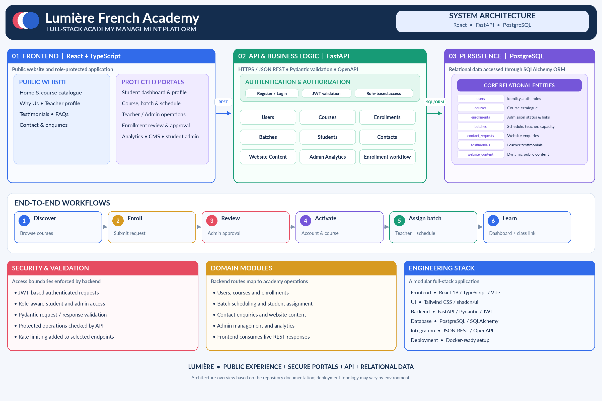
  <p><em>End-to-end architecture: public website and protected portals → FastAPI REST API → PostgreSQL through the ORM layer.</em></p>
</div>

### Architecture explained

| Layer | Responsibility |
|---|---|
| **React + TypeScript frontend** | Renders public pages and protected student/teacher/admin experiences; calls backend APIs over HTTPS using JSON. |
| **Authentication & authorization** | Handles registration and login, validates JWTs, and applies role-based access rules to protected operations. |
| **FastAPI domain modules** | Implements application endpoints and workflows for users, courses, enrollments, batches, students, contacts, and website content. |
| **Pydantic schemas** | Validates incoming request data and shapes API responses. |
| **SQLAlchemy ORM** | Maps application models and database operations to relational persistence. |
| **PostgreSQL** | Stores accounts, courses, enrollment state, batch information, contact requests, testimonials, and website content. |

**Request path:** Frontend → HTTPS/JSON REST API → authentication/authorization and validation → domain logic → SQLAlchemy → PostgreSQL. The response returns through the API to the frontend.

---

## ✨ Core capabilities

| Area | Capabilities |
|---|---|
| 🌐 Public website | Landing page, courses, Why Us, teacher profile, testimonials, FAQs, and contact |
| 🔐 Authentication | Registration, login, JWT authentication, protected routes |
| 🧑‍🎓 Student portal | Overview, course, batch, schedule, teacher, profile, and fee status |
| 📝 Enrollment | Enrollment requests, review, approval/rejection, activation, and batch assignment |
| 👨‍🏫 Batch management | Create/edit/delete batches, schedules, capacity, teacher, meeting link, and student assignment |
| 📚 Course management | Create, edit, delete, and manage academy courses |
| 👥 Student management | Student listing/details, activation, suspension, and deletion |
| 📞 Contact management | Website enquiries and admin-side handling |
| 📊 Analytics | Enrollment growth, admission funnel, active students, revenue, and courses |
| 🧩 Website content | API-driven website content with protected administrative editing |
| 🔌 REST API | FastAPI endpoints documented through OpenAPI/Swagger |

---

## 🔄 Enrollment lifecycle

The enrollment workflow connects the public course catalogue to the academy's day-to-day operations.

```text
Visitor discovers a course
          │
          ▼
Submits enrollment request
          │
          ▼
Admin reviews the request
          │
     ┌────┴─────┐
     ▼          ▼
   Reject     Approve
                 │
                 ▼
        Activate / assign batch
                 │
                 ▼
          Student portal
                 │
                 ▼
       Schedule + teacher details
                 │
                 ▼
            Join live class
```

This is an **approval-based enrollment workflow**. Online payment gateway integration is listed as a future enhancement, not as a currently implemented payment flow.

---

## 🔐 Authentication & role-based access control

The application separates public browsing from protected learner and administrative operations.

### 👤 Student experience

- View personal dashboard and enrolled course.
- View assigned batch, teacher, and timetable.
- Access the live class link.
- Check fee status and manage profile information.
- Contact the academy.

### 🧑‍💼 Teacher/Admin operations

- Manage courses.
- Review enrollment requests and approve/reject them.
- Activate students and assign them to batches.
- Create and manage batches.
- Manage student records and contact requests.
- Update website content and view analytics.

### 🔒 API-level security

Sensitive operations are protected at the backend rather than relying only on frontend visibility. Security-oriented features include password hashing, JWT authentication, role-aware authorization, Pydantic validation, protected API routes, and backend-side permission checks.

---

## 📡 API overview

The FastAPI backend exposes an OpenAPI/Swagger-documented REST API. The following routes represent the documented application surface.

### Authentication

```http
POST /auth/register
POST /auth/login
```

### Courses

```http
GET  /courses
POST /courses
GET  /courses/{slug}
```

### Current user

```http
GET /users/me
```

### Enrollments

```http
POST  /enrollments
GET   /enrollments/me
GET   /enrollments/{enrollment_id}
GET   /enrollments/admin/all

PATCH /enrollments/admin/{enrollment_id}/approve
PATCH /enrollments/admin/{enrollment_id}/reject
PATCH /enrollments/admin/{enrollment_id}/activate
PATCH /enrollments/admin/{enrollment_id}/assign-batch
```

### Batches

```http
GET    /batches
GET    /batches/me
GET    /batches/{batch_id}
POST   /batches/admin
PUT    /batches/admin/{batch_id}
DELETE /batches/admin/{batch_id}
```

### Students

```http
GET    /admin/students
GET    /admin/students/{student_id}
DELETE /admin/students/{student_id}
PATCH  /admin/students/{student_id}/activate
PATCH  /admin/students/{student_id}/suspend
```

### Contact

```http
POST   /contact
GET    /admin/contact
GET    /admin/contact/{contact_id}
PATCH  /admin/contact/{contact_id}
DELETE /admin/contact/{contact_id}
```

### Website content

```http
GET /website-content
PUT /admin/website-content
```

---

## 🗄️ PostgreSQL data model

PostgreSQL stores persistent relational application data. The principal entities documented for the platform are:

| Table / entity | Responsibility |
|---|---|
| `users` | Accounts, identity, and authentication data |
| `courses` | Course catalogue and course metadata |
| `enrollments` | Admission and enrollment lifecycle |
| `batches` | Schedule, teacher, capacity, and meeting information |
| `contact_requests` | Website leads and enquiries |
| `testimonials` | Learner/parent testimonials |
| `website_content` | Dynamic website content |

### Relationship overview

```text
users
  └── enrollments ─── courses
          └────────── batches

contact_requests
testimonials
website_content
```

SQLAlchemy ORM provides the application-side mapping to the relational database.

---

## 🧰 Technology stack

### Frontend
- React
- TypeScript
- Vite
- Tailwind CSS
- shadcn/ui
- Responsive UI and protected application routes

### Backend
- Python
- FastAPI
- Pydantic
- JWT authentication
- Role-based authorization
- REST APIs
- OpenAPI / Swagger

### Database & engineering
- PostgreSQL
- SQLAlchemy ORM
- Docker-ready setup
- Git and GitHub
- REST-based frontend/backend integration

---

# 📸 Application showcase

The screenshots below are retained so visitors can see the actual public website, student experience, administration tools, API documentation, and database view.

## 🏠 Landing page

### Light mode

<p align="center">
  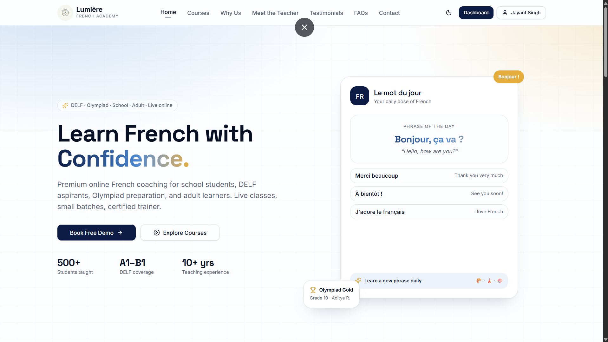
</p>

### Dark mode

<p align="center">
  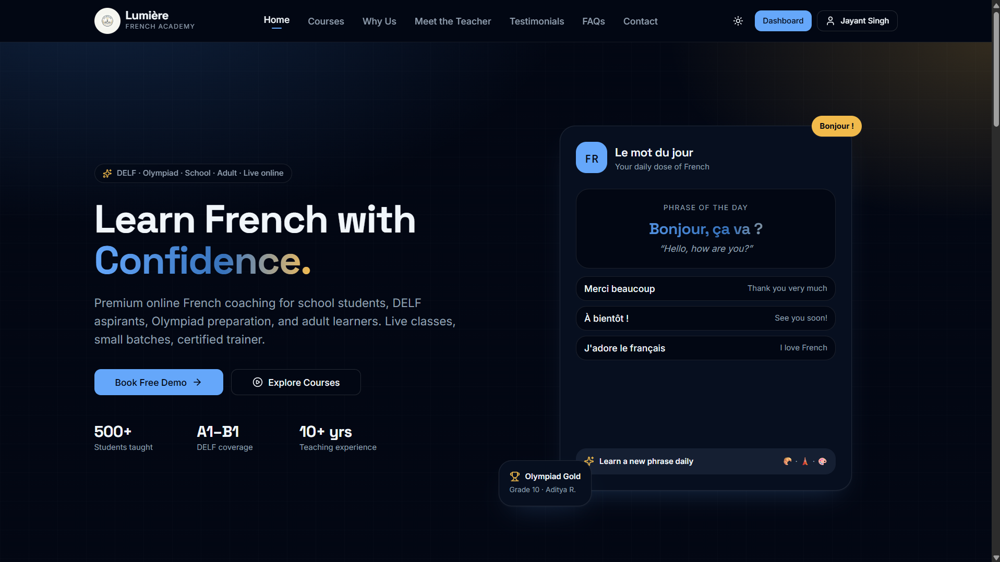
</p>

---

## 📚 Courses

<p align="center">
  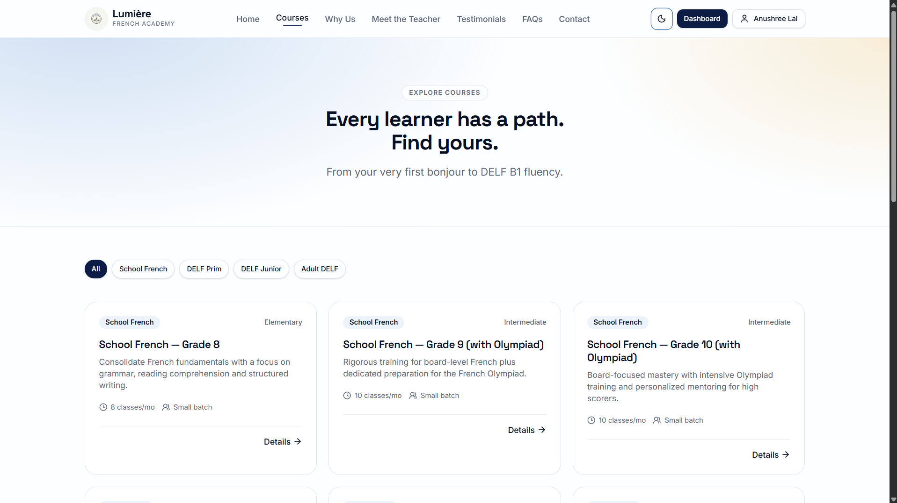
</p>

The catalogue presents learning paths across **School French, DELF Prim, DELF Junior, and Adult DELF**, with course level, class frequency, and learner-focused descriptions.

## 💡 Why Lumière

<p align="center">
  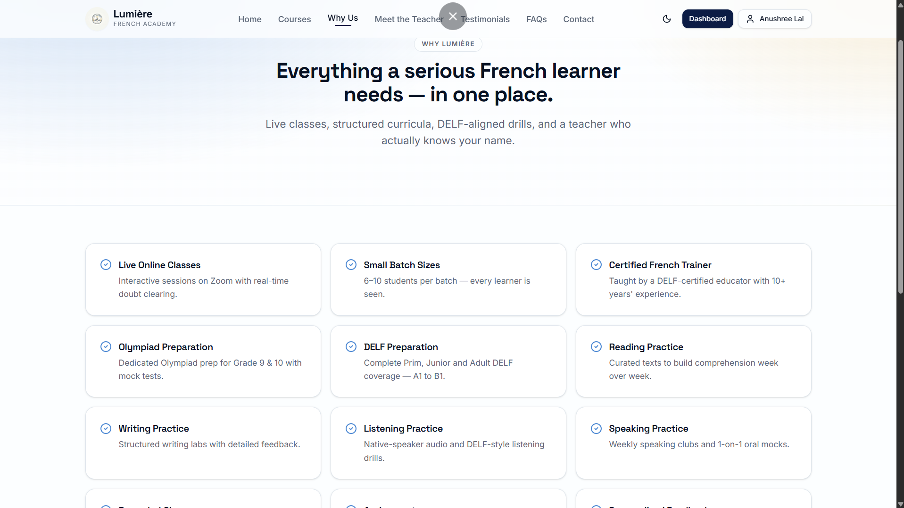
</p>

## 👩‍🏫 Teacher profile

<p align="center">
  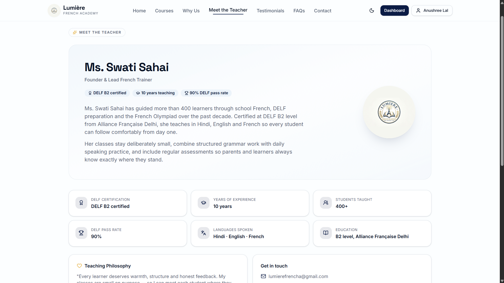
</p>

## ⭐ Testimonials

<p align="center">
  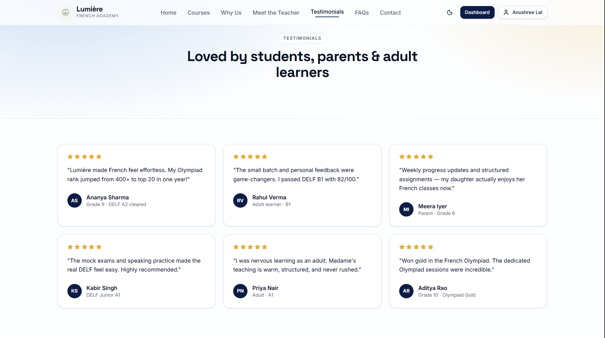
</p>

## ❓ FAQs

<p align="center">
  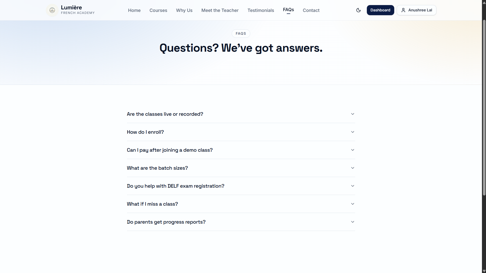
</p>

## 📞 Contact & demo booking

<p align="center">
  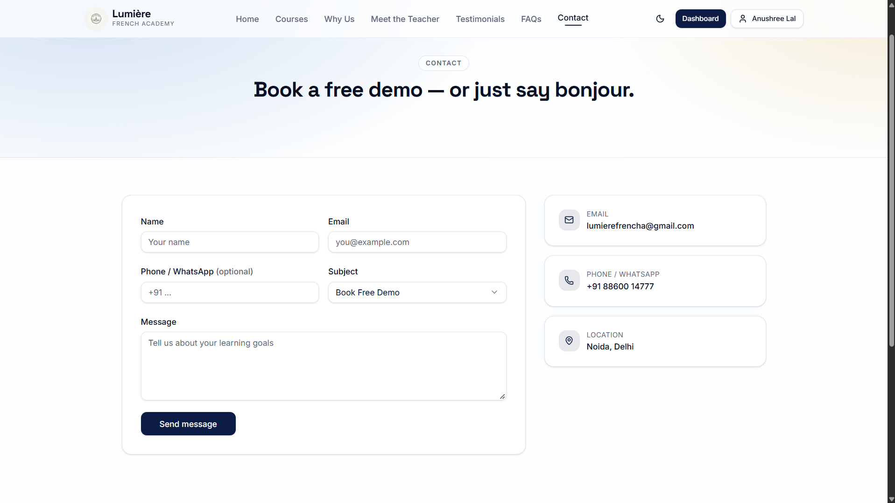
</p>

Website enquiries are captured by the backend and can subsequently be handled from the admin console.

---

# 🎓 Student portal

## Student dashboard

<p align="center">
  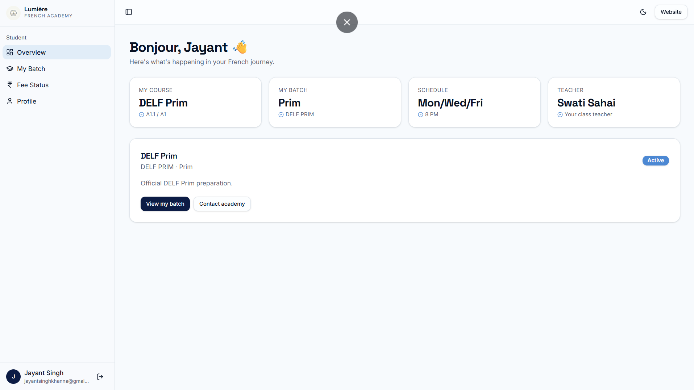
</p>

The student experience brings together the current course, assigned batch, schedule, teacher, enrollment state, quick access to batch details, and academy contact.

## My batch

<p align="center">
  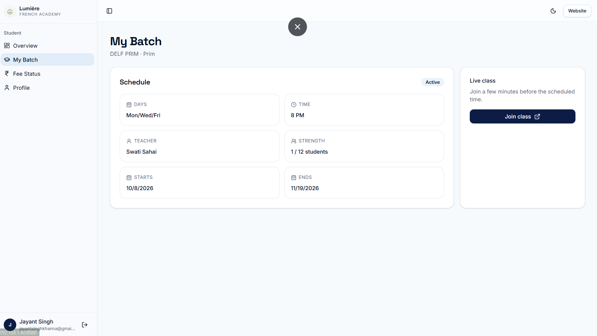
</p>

Students can view class days and time, teacher, batch strength, start/end dates, and the live-class entry point.

---

# 🛡️ Admin / Teacher console

The administration area is the operational control center for the academy.

## Admin dashboard

<p align="center">
  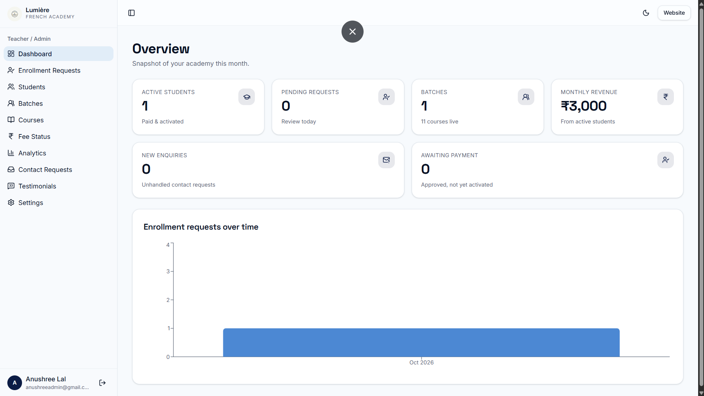
</p>

It surfaces operational metrics including active students, pending requests, batches, monthly revenue, new enquiries, and awaiting payment.

## Enrollment requests

<p align="center">
  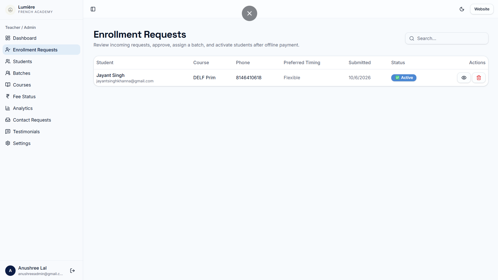
</p>

Admins can review incoming requests and progress them through the admission lifecycle.

## Course management

<p align="center">
  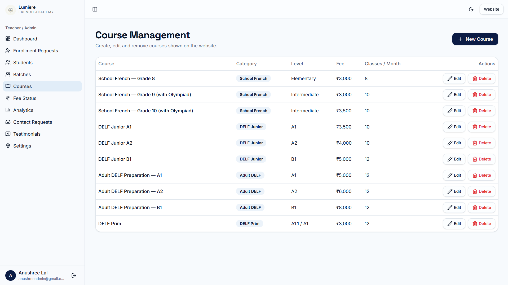
</p>

## Batch management

<p align="center">
  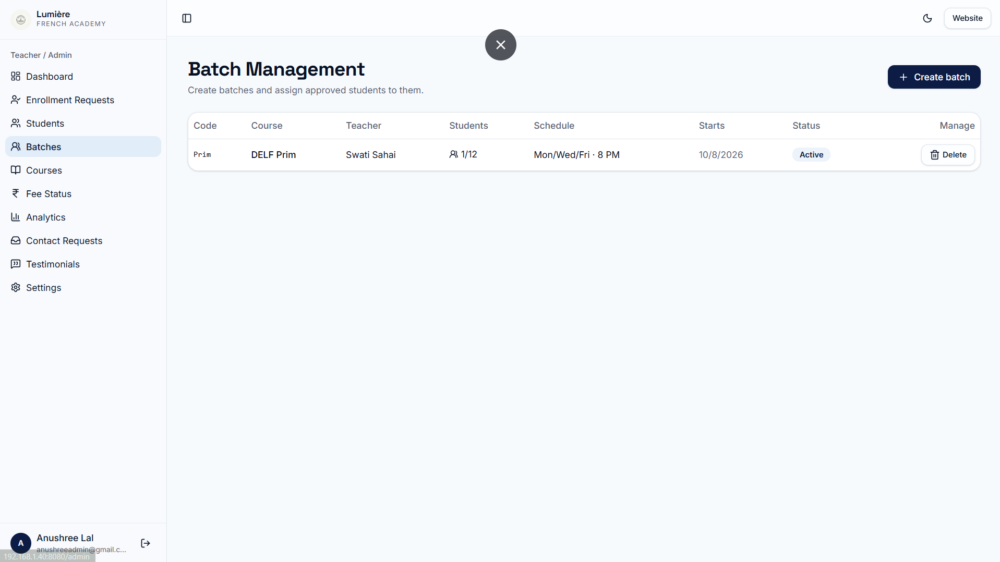
</p>

## Create batch

<p align="center">
  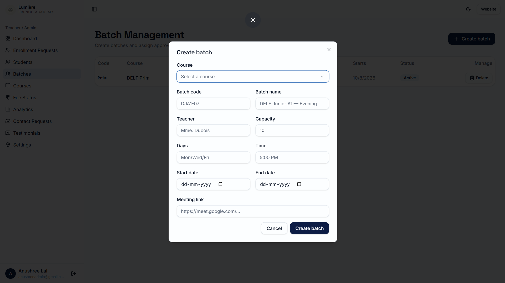
</p>

Batch creation supports course, code, name, teacher, capacity, days, time, start/end dates, and meeting-link details.

## Analytics

<p align="center">
  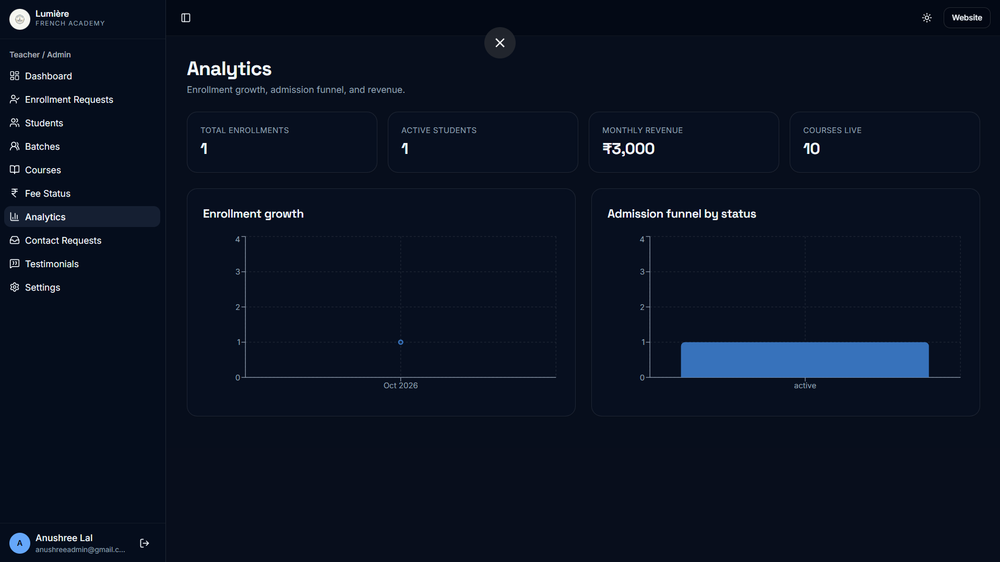
</p>

The analytics workspace presents enrollment growth, admission funnel, active students, monthly revenue, and live courses.

## Contact requests

<p align="center">
  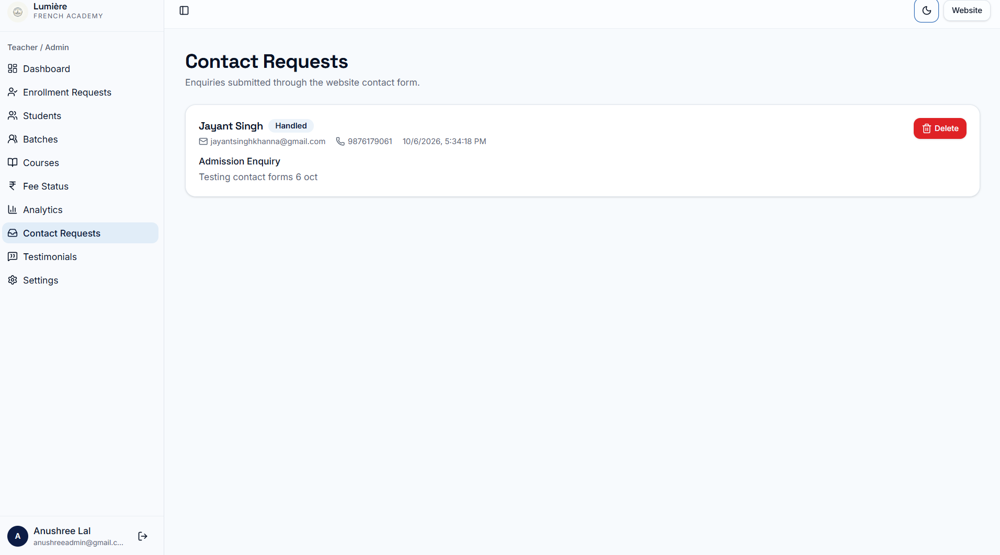
</p>

---

## 📘 API documentation

<p align="center">
  
</p>

The API documentation exposes the application surface for authentication, users, courses, enrollments, batches, students, contact requests, and website content, with structured request/response schemas through OpenAPI.

## 🗄️ Database view

<p align="center">
  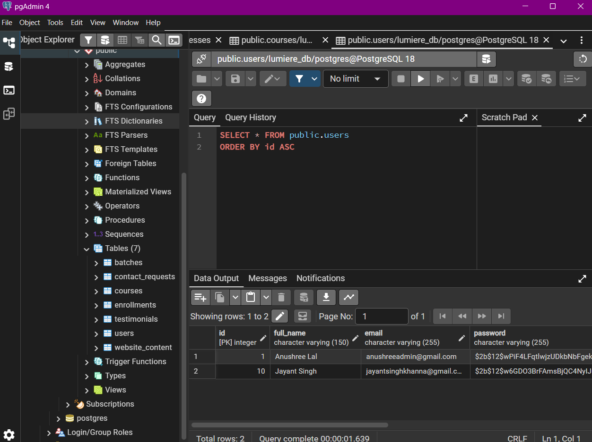
</p>

The database layer supports the academy's user, course, enrollment, batch, contact, testimonial, and website-content workflows.

---

## 🔐 Security request flow

```text
HTTP request
     │
     ▼
JWT authentication
     │
     ▼
Resolve current user
     │
     ▼
Role / permission check
     │
     ├── Student → permitted learner resources
     │
     └── Admin   → permitted management resources
     │
     ▼
Validation + business logic
     │
     ▼
SQLAlchemy ORM
     │
     ▼
PostgreSQL
```

Security-oriented capabilities include password hashing, JWT-based authentication, protected API routes, role-aware authorization, Pydantic validation, backend-side permission checks, and separation of public and administrative operations.

---

## 📈 Product workflow

```text
                         ┌───────────────┐
                         │  Public Site  │
                         └───────┬───────┘
                                 │
                  ┌──────────────┼──────────────┐
                  ▼              ▼              ▼
               Courses        Contact        Register
                  │              │              │
                  ▼              ▼              ▼
             Enrollment       Enquiry          Login
                  │                             │
                  └──────────────┬──────────────┘
                                 ▼
                         ┌─────────────────┐
                         │  Admin Review   │
                         └────────┬────────┘
                                  │
                         Approve / Reject
                                  │
                                  ▼
                         ┌─────────────────┐
                         │ Assign a Batch  │
                         └────────┬────────┘
                                  │
                                  ▼
                         ┌─────────────────┐
                         │ Student Portal  │
                         └────────┬────────┘
                                  │
                                  ▼
                     Schedule / Teacher / Class
```

---

## ✅ Feature matrix

| Module | Status |
|---|:---:|
| Public website | ✅ |
| Responsive UI | ✅ |
| Light / dark theme | ✅ |
| Authentication | ✅ |
| JWT-protected APIs | ✅ |
| Role-based access control | ✅ |
| Course management | ✅ |
| Enrollment workflow | ✅ |
| Batch management | ✅ |
| Student management | ✅ |
| Contact management | ✅ |
| Student dashboard | ✅ |
| Admin dashboard | ✅ |
| Analytics dashboard | ✅ |
| PostgreSQL persistence | ✅ |
| Swagger / OpenAPI | ✅ |
| Website content management | ✅ |
| Docker-ready setup | ✅ |

---

## 📁 Repository showcase assets

The repository includes visual assets used throughout this README:

```text
.
├── Lumiere_French_Academy_Architecture_Final.png
├── Landing_Page_Dark.png
├── Landing_Page_White.png
├── Courses_Page.png
├── Why_Us_Page.png
├── Teacher_Page.png
├── Testimonals_Page.png
├── FAQs_Page.png
├── Contact_Page.png
├── Student_Dashboard.png
├── Student_MyBatch.png
├── Admin_Dashboard.png
├── Admin_Enrollments.png
├── Admin_CourseManagement.png
├── Admin_Batch.png
├── Admin_CreateBatch.png
├── Admin_Analytics.png
├── Admin_Contact.png
├── PostgreSQL_Db.png
├── api.png
├── register.png
├── logo.png
└── README.md
```

---

## 🎯 Engineering philosophy

> **Keep the learner experience elegant while keeping the operational system structured.**

The project emphasizes:

- 🧱 Clear separation of responsibilities
- 🔐 Secure access boundaries
- 🗄️ Data-driven workflows
- 🔄 Explicit business state transitions
- 🧩 Reusable UI components
- 📡 Clean REST contracts
- 📈 Analytics-ready data
- 🚀 Production-oriented engineering

## 🔮 Future enhancements

Potential next steps for the platform include:

- 💳 Online payment gateway integration
- 📧 Automated email / WhatsApp notifications
- 📅 Attendance tracking
- 📊 Student progress analytics
- 🧑‍🏫 Dedicated teacher dashboard
- 🧾 Invoices and receipts
- 🔔 Real-time notifications
- 🧪 Automated API / integration tests
- ☁️ Production cloud deployment
- 📦 CI/CD pipelines
- 🔎 Advanced reporting and exports

---

## 🔒 Repository note

This repository is maintained as a **public portfolio and product showcase**. The README documents the product architecture, API surface, workflows, data model, and visual implementation. Application implementation details that are not intended for public distribution are intentionally not reproduced here.

---

<div align="center">

### 🇫🇷 Merci beaucoup!

**Lumière French Academy — Learn French. Build confidence.**

⭐ Star the repository if you enjoyed exploring the project.

</div>
