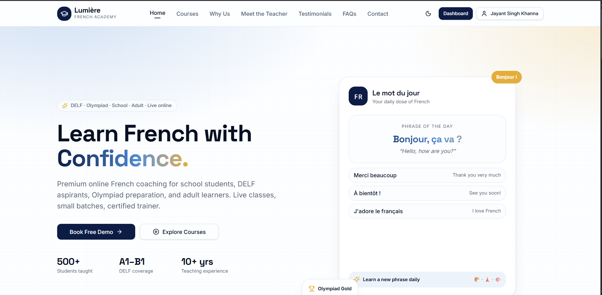
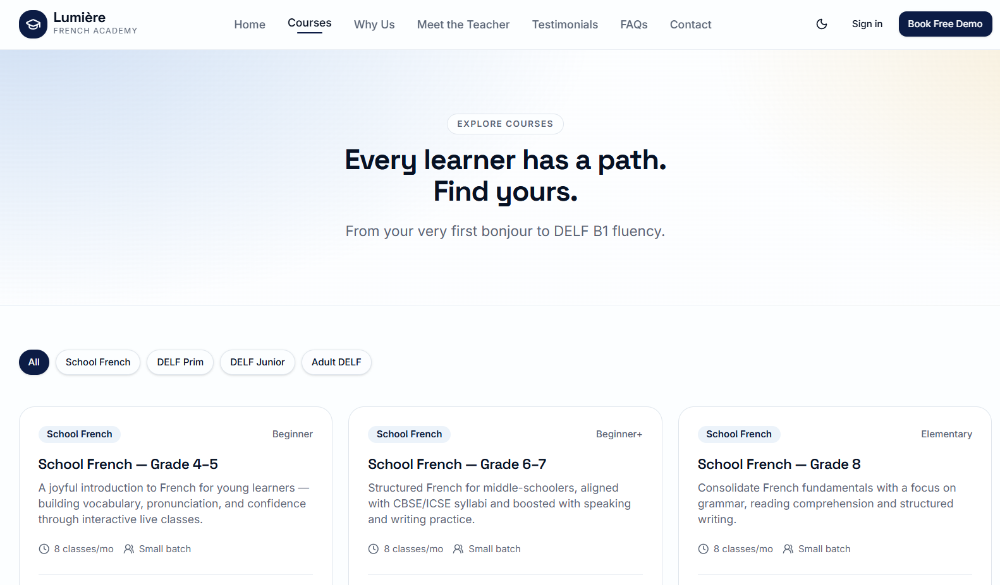
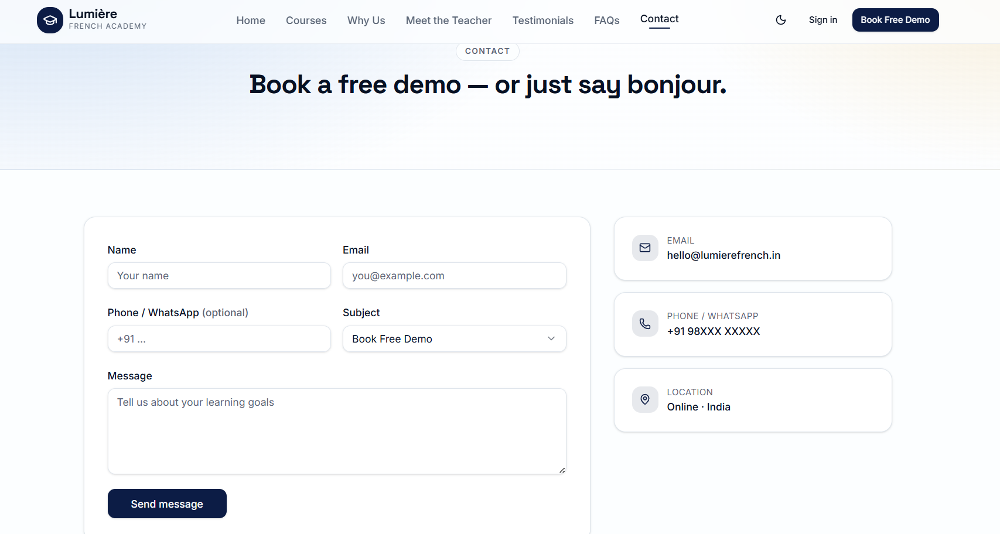
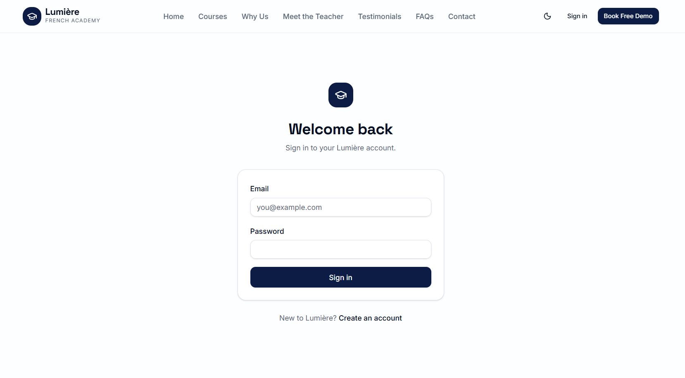
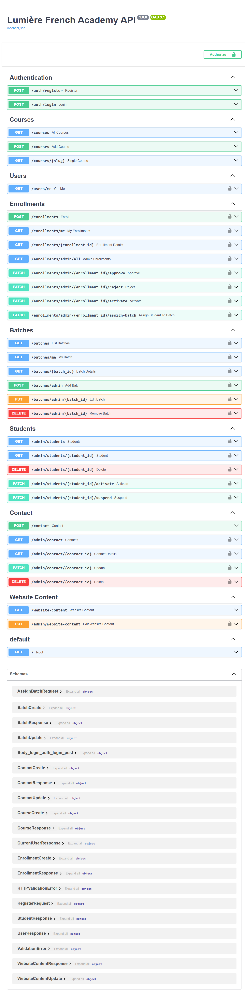

<div align="center">

# 🇫🇷 Lumière French Academy

### A Modern Full-Stack Learning Platform for French Language Education


<p>
<b>React • TypeScript • FastAPI • REST API • Authentication • Docker</b>
</p>

> Building a premium digital experience for French language learners.

🚧 **Work in Progress — Continuously evolving with new features and improvements.**

</div>

---

# ✨ About The Project

Lumière French Academy is a production-oriented full-stack web application developed for a modern French language institute.

The goal of this project is to provide a seamless experience for students, teachers, and administrators through an elegant frontend backed by a scalable REST API architecture.

Unlike a simple educational website, this platform manages the complete student lifecycle—from discovering courses to enrollment, authentication, batch management, and administrative operations.

This repository serves as a **public showcase** of the application's development journey. The source code remains private while screenshots, architecture, UI evolution, and feature progress are documented here.

---

# 🌟 Highlights

- 🎨 Modern responsive interface
- 🔐 Complete authentication system
- 📚 Dynamic course management
- 📝 Student enrollment workflow
- 👨‍🏫 Batch allocation system
- 📞 Contact & lead management
- 🛠️ Admin dashboard
- 🌐 RESTful API backend
- ⚡ FastAPI powered services
- 🐳 Docker-ready architecture
- 📱 Mobile responsive design
- 🎯 Production-focused project structure

---

# 📸 Application Preview

## 🏠 Landing Page

The homepage introduces the academy with a clean and premium design, highlighting courses, achievements, daily French phrases, and quick access to registrations.



---

## 📖 Courses

Browse available French programs with categorized learning paths, difficulty levels, course descriptions, and enrollment options.



---

## 📞 Contact & Demo Booking

A fully functional inquiry and demo booking system allowing prospective students to connect directly with the academy.



---

## 🔐 Authentication

Secure login system supporting authenticated student access and protected application features.



---

## ⚙️ Backend API Documentation

A robust FastAPI backend exposing REST endpoints for authentication, enrollments, course management, student management, batch management, website content, and administrative operations.



---

# 🏗️ System Architecture

```text
                React + TypeScript Frontend
                          │
                          │ REST API
                          ▼
                 FastAPI Backend Services
                          │
      ┌───────────────────┼────────────────────┐
      │                   │                    │
 Authentication      Course Engine      Contact Module
      │                   │                    │
      ├────────────── Enrollment System ───────┤
      │                   │                    │
 Batch Management    Student Portal     Admin Dashboard
                          │
                          ▼
                       Database
```

---

# 🚀 Features

## Student Side

- Responsive landing page
- Browse French courses
- Student registration
- Secure login
- Book free demo
- Contact academy
- Course exploration
- Personal dashboard
- Enrollment management

---

## Admin Side

- Course CRUD
- Student Management
- Enrollment Approval
- Batch Assignment
- Website Content Management
- Contact Requests
- User Management
- Batch Administration

---

## Backend

- JWT Authentication
- REST APIs
- Request Validation
- Protected Routes
- Role-based Authorization
- CRUD Operations
- API Documentation (Swagger)
- Modular Architecture

---

# 🧠 Backend Modules

The backend is organized into multiple independent modules to ensure scalability and maintainability.

### Authentication

- User Registration
- Secure Login
- JWT Token Authentication
- Protected Endpoints

### Courses

- Add Courses
- Update Courses
- Course Retrieval
- Dynamic Course Pages

### Enrollments

- Student Enrollment
- Approval Workflow
- Rejection Workflow
- Activation
- Batch Assignment

### Batch Management

- Create Batch
- Edit Batch
- Delete Batch
- Student Allocation

### Student Management

- Student Profiles
- Activation
- Suspension
- Administrative Controls

### Contact Management

- Inquiry Submission
- Lead Tracking
- Admin Responses

### Website CMS

- Dynamic Website Content
- Content Updates
- API-driven Website Sections

---

# 📡 REST API

The application exposes a production-style REST API built using FastAPI.

### Authentication

```
POST /auth/register
POST /auth/login
```

### Courses

```
GET    /courses
GET    /courses/{slug}
POST   /courses
```

### Enrollments

```
POST   /enrollments
GET    /enrollments/me
PATCH  /approve
PATCH  /reject
PATCH  /assign-batch
```

### Batches

```
GET
POST
PUT
DELETE
```

### Students

```
GET
PATCH
DELETE
```

### Contact

```
POST
GET
PATCH
DELETE
```

---

# 💻 Technology Stack

## Frontend

- React
- TypeScript
- Vite
- Tailwind CSS
- shadcn/ui

## Backend

- FastAPI
- Python
- Pydantic
- JWT Authentication
- REST APIs

## Development

- Docker
- Git
- GitHub

---

# ⚙️ Development Progress

## Completed

- ✅ Responsive Landing Page
- ✅ Authentication System
- ✅ Dynamic Course Module
- ✅ Contact System
- ✅ Enrollment Workflow
- ✅ Batch Management
- ✅ Student Management
- ✅ REST API
- ✅ Swagger Documentation
- ✅ Frontend–Backend Integration
- ✅ Docker Development Setup

---

## Currently Working On

- 🚧 Student Dashboard Enhancements
- 🚧 Admin Dashboard UI
- 🚧 Analytics
- 🚧 Performance Optimization
- 🚧 Security Improvements
- 🚧 Production Deployment

---

# 📁 Repository Structure

```
├── home.png
├── courses.png
├── contact.png
├── register.png
├── api.png
└── logo.png

README.md
```

---

# 🎯 Design Philosophy

The project focuses on creating an experience that is:

- Clean
- Responsive
- Modern
- Fast
- Accessible
- Scalable
- Production Ready

Every page is designed with simplicity, readability, and usability in mind while maintaining a premium visual identity inspired by modern SaaS platforms.

---

# 🔒 About This Repository

This repository is intended as a **public portfolio showcase**.

To protect proprietary implementation details, the application source code is kept private.

Instead, this repository documents:

- UI Development
- Feature Progress
- Backend Capabilities
- API Design
- Application Screenshots
- Architecture Overview
- Development Journey

---

<div align="center">

## 🇫🇷 Merci beaucoup!

**Building the future of French language learning, one commit at a time.**

⭐ If you enjoyed exploring this project, don't forget to leave a star!

</div>
